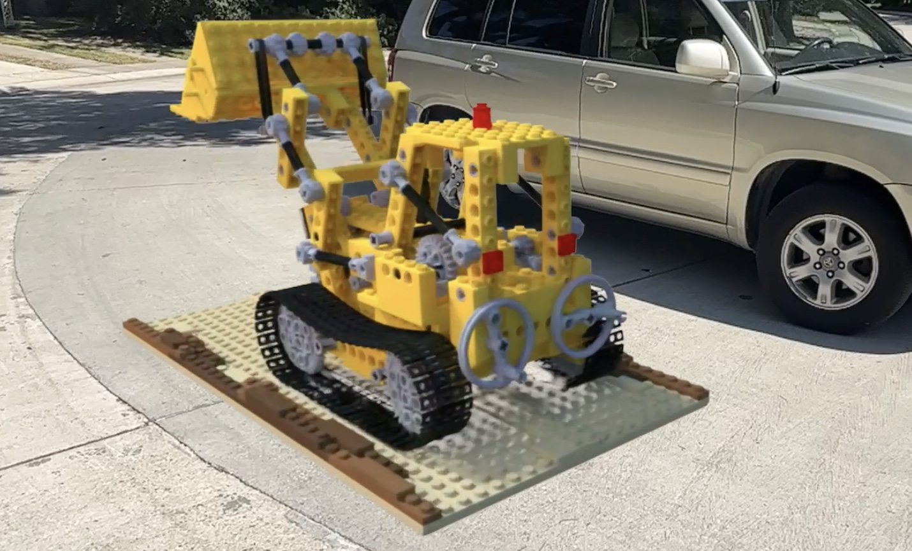

# AR Gaussian Splatting for iOS & Metal 



## About 
A buggy + slow AR gaussian splat renderer for iOS + Metal. 
Based on several existing projects:
- [Original Gaussian Splatting Repo](https://github.com/graphdeco-inria/gaussian-splatting/)
- [Unity Gaussian Splatting](https://github.com/aras-p/UnityGaussianSplatting)
- [WebGPU Gaussian Splatting from cvlab-epfl](https://github.com/cvlab-epfl/gaussian-splatting-web) 
- [MrNeRF gaussian splatting cuda](https://github.com/MrNeRF/gaussian-splatting-cuda)


Uses [Satin + Forge](https://github.com/Hi-Rez/Satin) for AR + 3d viewer ( by [@rezaali](https://twitter.com/RezaAli) )


Only tested on an iPhone 14 Pro. Older phones will probably struggle. You can adjust the render resolution when loading a model by increasing the rendererDownsample to 4x or more on the 'SplatModelInfo' struct. 


:warning: This was a quick weekend hack project for educational purposes. As such the code is bad.  

🔹 NOTE: PLY models use [git LFS](https://git-lfs.com/) for file storage. You may need to run ```git lfs pull``` if PLYs are missing


## Notes 
- Does not use a tile based renderer, just basic quad rasterization
- Spherical harmonics are not supported
- Sorting is done on main thread with std::sort on CPU 
### Todos
- fix pan / drag / rotate gesture handling for moving the model - now it's broken
- snap models to AR planes
- GPU sorting 
- detect centroids and model extents on load rather than hand specifying

## Demo Video 
[](https://youtu.be/2th0ejgNu4U)

video credit: Nike shoe model from [Alex Carliera](https://twitter.com/alexcarliera)

## License(s)
Parts of the code are based on the original Gaussian-Splatting software and is governed by the [Gaussian-Splatting License](https://github.com/graphdeco-inria/gaussian-splatting/blob/main/LICENSE.md), which can be found in the [LICENSE]() file in this repository. The original software was developed by Inria and MPII.

Please be advised that the software in this repository cannot be used for commercial purposes without explicit consent from the original licensors, Inria and MPII.

[Satin + Forge](https://github.com/Hi-Rez/Satin) are released under the MIT license. See [LICENSE](https://github.com/Hi-Rez/Satin/blob/master/LICENSE) for details. 

## Train your own model 
There are several [blog posts](https://www.reshot.ai/3d-gaussian-splatting) on how to train your own models from a set of images. 
The output PLY model is what you want to keep ( e.g. 'iteration_30000/point_cloud.ply' ) 
The included models were trained on google colab with an A100 GPU. 

[](https://colab.research.google.com/drive/1I8T2zlE7fQK06uNfezr4tOa_5xSq9XIg?usp=sharing) 


## Models Attribution
Includes two models from the NeRF synthetic blender dataset 

The renders are from modified blender models located on blendswap.com:
- lego by Heinzelnisse (CC-BY-NC): https://www.blendswap.com/blend/11490
- mic by up3d.de (CC-0): https://www.blendswap.com/blend/23295

